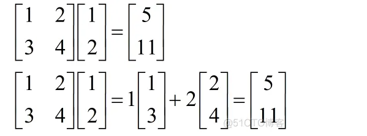

## torch基础
numpy默认创建的浮点类型为float64，注意这一torch tensor的默认行为不同，tensor默认情况下创建的float tensor是32位的，32位的浮点数已经能够满足梯度运算。因此在用numpy处理数据时需要注意转换成float32类型
## torch api
### torch.randperm

torch.randperm(n, *, generator=None, out=None, dtype=torch.int64, layout=torch.strided, device=None, requires_grad=False, pin_memory=False) → Tensor

返回从0到(n-1)数字的随机的排列

### torch.split

torch.split(tensor, split_size_or_sections, dim=0)

分割tensor成若干个块

tensor：torch.Tensor, 要分割的tensor

split_size_or_sections:{int, list(int)},单一chunk的数量

dim：int,沿着那个tensor进行分割

###  torch.dot、torch.mul、torch.mm、torch.bmm、torch.matmul，*与@
torch.dot只能用在1维tensor上，计算两个向量内积 
torch.mul element-wise的运算，形状符号的都可以 
torch.mm 矩阵乘法，只能用于2维数组，且必须满足中间相同取两边，类似lxm与mxl形状的数组相乘 
torch.bmm torch.mm的升级版本，忽略第一维度进行矩阵乘法 
torch.matmul最强大：
如果a,b都是1d,执行torch.dot 
如果都是2d，执行torch.mm 
如果第a是1d,b是2d,为a添加一个前置维度，执行torch.mm 
如果a是2d,b是1d,执行矩阵与向量的乘法 
  
如果
运算符*映射到torch.mul,element-wise的运算，形状相同或者符合[广播机制](CodeForTool/np/README.md)都可以做
运算符@映射到torch.matmul

