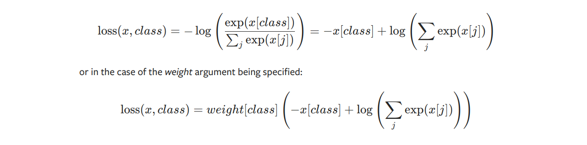

## api

### F.nll_loss 负对数似然损失与CrossEntropy

CrossEntropy非常强大，**传入的target可以是onehot编码也可以是单个标签值**

进行mini-batch运算时，**reduction设置为none能够计算单个样本的loss**

def nll_loss(

​    *input*: Tensor,

​    *target*: Tensor,

​    *weight*: Optional[Tensor] = None,

​    *size_average*: Optional[bool] = None,

​    *ignore_index*: int = -100,

​    *reduce*: Optional[bool] = None,

​    *reduction*: str = "mean",

) -> Tensor:

log_softmax + nll_loss = CrossEntropy

```python
import torch
from torch.nn import functional as F

x = torch.randn(size=(16, 10)), dim=1
y = torch.randint(0, 9, (16, ))
loss1 = F.nll_loss(F.log_softmax(x), target=y)
# 等价于
x1 = F.softmax(x,dim=1)
o1 = x1[range(16),y]
loss2 = torch.mean(-torch.log(o1))
print(loss1 == loss2)
#等价于
loss3 = F.cross_entropy(x,y)
```

**这里主义log_softmax不等于softmax+log的，softmax有上溢和下溢问题，log_softmax解决了，CrossEntropy用的是log_softmax**


### torch.nn.Identity() 占位符,直接返回input。

1. 占位符

```python
self.linear_out = nn.Linear(in_dim if num_layers == 1 else inner_dim, out_dim) if num_layers >= 1 else nn.Identity()
```

2. 便于迁移权重

### with autograd.detect_anomaly()

开启后可以自动检查异常梯度、nan梯度等

### log_softmax

log_softmax数学上与log(softmax(x))等同，但计算时会优化，优化后也解决了上溢和下溢问题



### KLDivLoss与nn.functional.kl_div:

`注意传入的input必须要是log后的结果，而target需不需要取决于参数log_target(默认为False，默认情况下传入的target是没有log过的的)`

KL散度


$$
L(input, target) = target \cdot log \frac{target}{input} = target \cdot (logtarge - log input)
$$
但在实现时：


